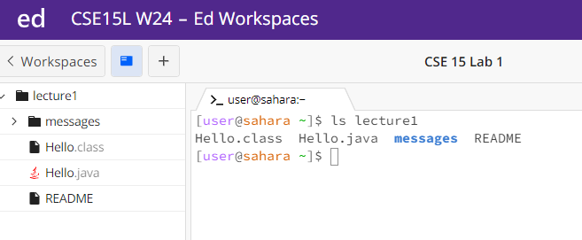

# Lab Report 1

## Command 1 - `cd`

### Case 1 - No argument
When you use the `cd` command wihtout an arguments it does nothing, as you are trying to change directory to nothing.
The directory stays the same. The working directory at this time was /home. I don't think this was an error either.

### Case 2 - Path to a directory as argument
When you use the `cd` command with a path to a directory as an argument it changes the directory to the specified directory
that the path is for as seen in the image below. I used `lecture1` as the path to the directory, and the directory was changed
to lecture1. The working directory before the code was run was /home, after it was /home/lecture1. It was not an error.

### Case 3 - Path to a file as argument
When you try to run the `cd` command with a path to a file as an argument it specifies that the path leads to a file and not 
a directory. As you can see in the image, I ran the `cd` command with `lecture1/Hello.java` as the argument and it
returned `bash: cd: lecture1/Hello.java: Not a directory`. The working directory was /home. It was an error, becasue the
`cd` command only works with paths to directories as arguments.

## Command 2 - `ls`

### Case 1 - No argument
When you run the `ls` command with no argument, it lists all the files and folders in the current directory as shown in the
picture below. The working directory was /home/lecture1.

### Case 2 - Path to a directory as argument
When you run the `ls` command with a path to a directory as an argument it lists all the files and folders in the directory
that the path leads to. The working directory was /home.

### Case 3 - Path to a file as argument
When you run the `ls` command with a path to a file as an argument, it just returns the path to the file as shown in the
image below. The working directory was /home. I don't think this was an error either.

## Command 3 - `cat`

### Case 1 - No argument
When you run `cat` with no argument what happens is very weird as it doesn't run and keeps the kernel frozen. Get out of
this situation with Ctrl + C. The image below shows the situation. The working directory was /home. I do not think this
was an error but it was still weird.

### Case 2 - Path to a directory as argument
When yo urun `cat` with a path to a directory as an argument it just says that the directory that the path leads to is a 
directory as shown in the image below. The working directory was /home.

### Case 3 - Path to a file as argument
When you run `cat` with a path to a file as an argument then it displays the contents of the file that the path leads to
as shown in the image below. The working directory was /home.

