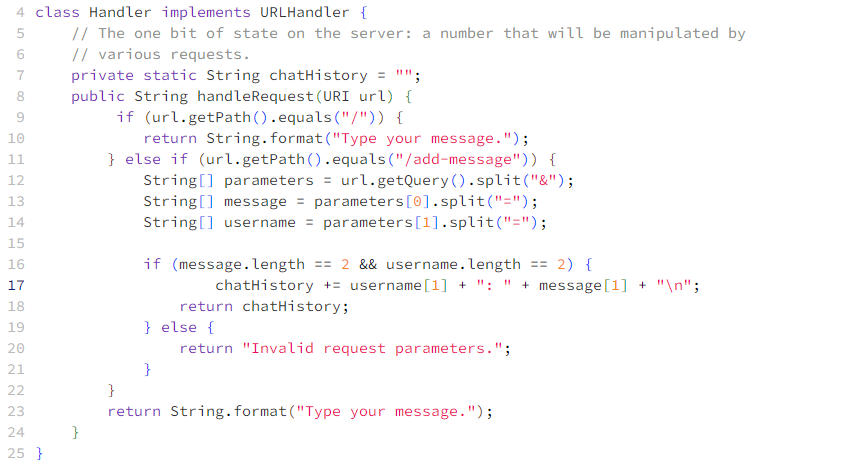
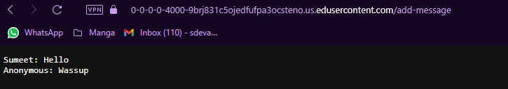
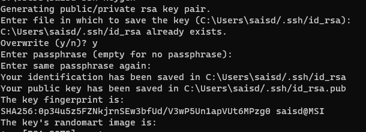
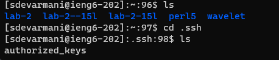
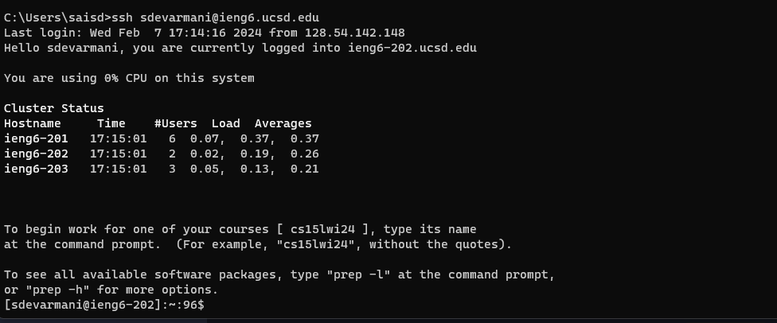

# Lab Report 2

## Part 1

### Code for ChatServer

### Screenshots of me using the code

### Explanation
Each time I use the `/add-message` to use the ChatServer, the handleRequest method is called. The relevant argument to the method is the url of type URI.
The values of parameters[] array are the parts of the url after the `?` split in two parts at the `&` in the url.
After the first call, they are "s=Hello" and "user=Sumeet".
After the second call, they are "s=Wassup" and "user=Anonymous".
The values of the message[] array are the parts of the value at 0 index of the parameters[] array split at the `=` sign.
After the first call, they are "s" and "Hello".
After the second call, they are "s" and "Wassup".
The values of the username[] array are the parts of the value at 1 index of the parameters[] array split at the `=` sign.
After the first call, they are "user" and "Sumeet".
After the second call, they are "user" and "Anonymous".
The values of the chatHistory String is " " before calling the method, after I call it the first time it becomes "Sumeet: Hello". After calling it the second time it becomes "Sumeet: Hello /n Anonymous: Wassup".

## Part 2
You can see the absolute path to the private key for my SSH key for logging into ieng6 in the following screenshot, the path is: C:\Users\saisd/.ssh/id_rsa

You can see the absolute path to the public key for your SSH key for logging into ieng6 through ls in the screenshot below, the absolute path is: /home/.ssh/authorized_keys

Here is a screenshot of me logging into ieng6 wihtout being prompted for the password.

## Part 3
I learnt how to use the ssh commands. I also learnt how to log into ieng6 wihtout having to type the password over and over on my computer. I also learnt how to make a simple Chat Server.
