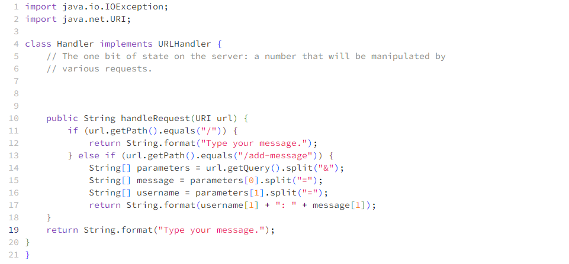
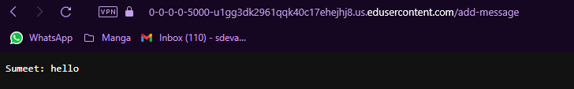
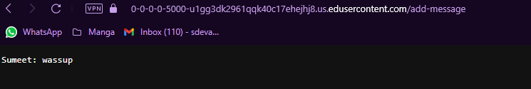

# Lab Report 2

## Part 1

### Code for ChatServer

### Screenshots of me using the code

### Explanation
Each time I use the `/add-message` to use the ChatServer, the handleRequest method is called. The relevant argument to the method is the url of type URI.
The values of parameters[] array are the parts of the url after the `?` split in two parts at the `&` in the url.
The values of the message[] array are the parts of the value at 0 index of the parameters[] array split at the `=` sign.
The values of the username[] array are the parts of the value at 1 index of the parameters[] array split at the `=` sign.

## Part 2

## Part 3
I learnt how to use the ssh commands.
