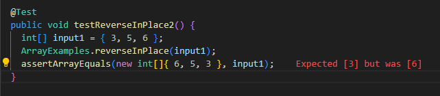
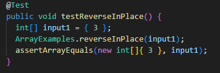
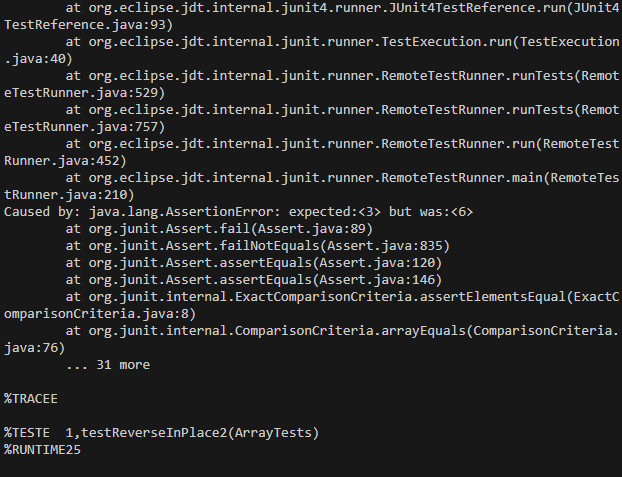
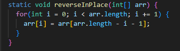
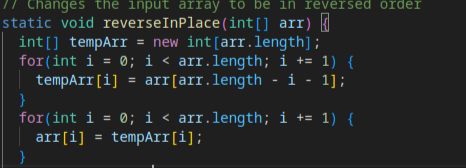
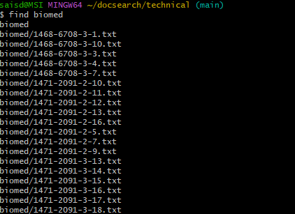
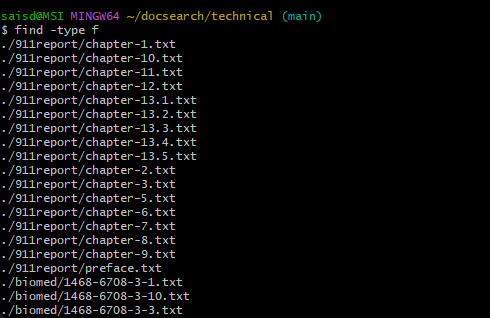

# Lab Report 3

## Part 1

### The Bug, Failure inducing Input

The above image shows the failure inducing input as a Junit test.

The above image shows an input which does not fail as a Junit test.

The above image shows the symptom of the bug.

The above image shows the code before the change that should be made to fix the bug. The image below shows the image after the change has been made.

The change resolves this problem since the original code attempted to assign values that were already reversed to the end of the array from the beginning, leaving the values in the second half of the array unchanged. To ensure that none of the original values were altered before the whole array was reversed, I created a temporary array to retain the reversed values before inserting them into the argument array.  

## Part 2
I choose the `find` command. The four command-line options I choose for the `find` command are `find «directory-path»`, `find -type <<type>>`, `find -print`, and `find-empty`. 

### `find <<directory-path>>`
Beginning with this command line option, it searches (recursively) in a directory for files and lists them all. The two examples of me using it are down below.

Example 1: 
Input - `find 911report`
Output - `911report
911report/chapter-1.txt
911report/chapter-10.txt
911report/chapter-11.txt
911report/chapter-12.txt
911report/chapter-13.1.txt
911report/chapter-13.2.txt
911report/chapter-13.3.txt
911report/chapter-13.4.txt
911report/chapter-13.5.txt
911report/chapter-2.txt
911report/chapter-3.txt
911report/chapter-5.txt
911report/chapter-6.txt
911report/chapter-7.txt
911report/chapter-8.txt
911report/chapter-9.txt
911report/preface.txt`

Example 2: 
Input - `find biomed`
Output - There are way too many files to list them all here. Ultimately, it just listed all of the files in biomed. I'll still attach a screenshot just in case.

### `find -type <<type>>`
This command line option specifies the type of file to search for. For example, f for regular files. The two instances of me using it are below.

Example 1:
Input - `find -type f`
Output - It printed out all the regular fles in the techincal directory, there are way too many to display. There is a screenshot attached.

Example 2:
Input `find -type d`
Output - `.
./911report
./biomed
./government
./government/About_LSC
./government/Alcohol_Problems
./government/Env_Prot_Agen
./government/Gen_Account_Office
./government/Media
./government/Post_Rate_Comm
./plos
`

### `find -print`
This command line option prints the pathnames of the files found.

Example 1:
Input - `find 911report -name "chapter-1.txt" -print`
Output - `911report/chapter-1.txt`

Example 2:
Input -  `find -name "pmed.0010024.txt" -print`
Output - `./plos/pmed.0010024.txt`

### `find -empty`
This command line option searches for empty files and directories in the path specified.

Example 1:
Input - `find -empty`
Output - Nothing, because there are no empty file in the technical directory.

Example 2:
Input `find 911report -empty`
Output - Nothing, because there are no empty file in the 911report directory.

## Citations
I used ChatGPT to find the command line options for `find`. My prompt was "find command-line options"
The output was:
"The find command in Unix-like operating systems is a powerful tool for searching for files and directories within a directory hierarchy based on various criteria. Here are some commonly used command-line options with find:

-name pattern: Searches for files and directories with the specified name pattern.
Example: find /path/to/search -name "*.txt"

-type type: Specifies the type of file to search for (f for regular file, d for directory, l for symbolic link, etc.).
Example: find /path/to/search -type d

-size [+|-]size[units]: Searches for files of a specific size. Use + for greater than, - for less than, and no symbol for exact size.
Example: find /path/to/search -size +1M

-mtime n: Searches for files modified n days ago. Use +n for more than n days ago, -n for less than n days ago, and n for exactly n days ago.
Example: find /path/to/search -mtime +7

-exec command {} \;: Executes a command on each found file or directory. '{}' represents the path to each found item.
Example: find /path/to/search -name "*.txt" -exec chmod 644 {} \;

-print: Prints the pathnames of the files found.
Example: find /path/to/search -name "*.txt" -print

-delete: Deletes the files found (use with caution).
Example: find /path/to/search -name "*.tmp" -delete

-maxdepth levels: Restricts the depth of the search to the specified number of directory levels.
Example: find /path/to/search -maxdepth 2 -name "*.txt"

-mindepth levels: Specifies the minimum depth for the search.
Example: find /path/to/search -mindepth 3 -name "*.txt"

-empty: Searches for empty files and directories.
Example: find /path/to/search -empty

These are just a few of the many options available with the find command. You can explore more options and combinations by referring to the manual page (man find)."

