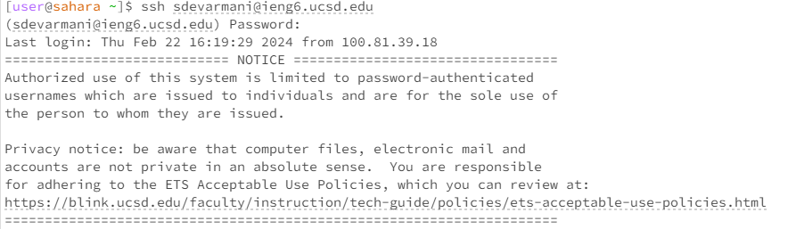
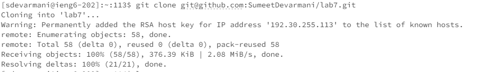
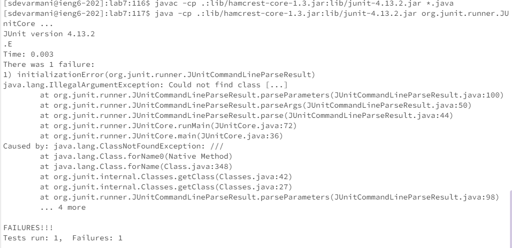
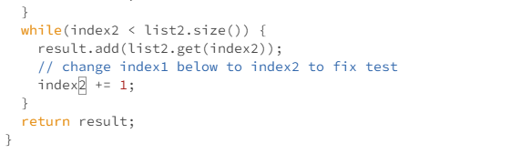

# Lab Report 4

I began by opening a terminal in the EdStem workspace. Then I logged into ieng6 as shown in the screenshot below.
Keys pressed: `<s><s><h><space><s><d><e><v><a><r><m><a><n><i><@><i><e><n><g><6><.><u><c><s><d><.><e><d><u><enter>`. To log into ieng6.

Then, I cloned the Lab 7 repository with the SSH clone as shown in the screenshot below.
Keys pressed: `<g><i><t><space><c><l><o><n><e><space><ctrl>+<v>`. I used Ctrl + V to paste the ssh url as I had copied it earlier.

Then, I ran the tests to demonstrate that they fail as shown in the screenshot below.
Keys pressed: `<ctrl>+<v><enter><ctrl>+<v><enter>`. I copied the commands to run the tests from the week 7 lab, so I used Ctrl + V.

Then I edited the code in ListExamples.java using Vim as shown below in the screenshot.
Keys pressed: `<v><i><m><space><L><i><tab><.><j><a><v><a><enter><G><k><k><k><k><k><k><e><r><2><:><w><q><enter>`. Ran `vim ListExamples.java` to get into vim, used `Tab` there to save time. Then pressed `G` to go to end of file, press `k` 6 times to go up, press `e` to go to end of index1, then pressed `r2` to replace the 1 with 2. Lastly, `wq` to save changes.

I proceeded to run the tests again to demonstrate that they pass now as shown in the screenshot below.
Keys pressed: `<up><up><up><up><enter>`, `<up><up><up><up><enter>` The `javac -cp .:lib/hamcrest-core-1.3.jar:lib/junit-4.13.2.jar *.java` command was 4 up in the search history, so I used up arrow to access it. Then the `java -cp .:lib/hamcrest-core-1.3.jar:lib/junit-4.13.2.jar org.junit.runner.JUnitCore ...` command was 4 up in the history, so I accessed and ran it in the same way.

Lastly, I committed and pushed the resulting change to my Github account as shown below in the screenshot.

