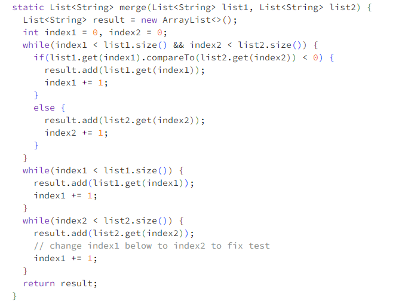

# Lab Report 5

## Part 1

Student: Help Needed. I have been wotking on a java program that takes two sorted list of strings, and returns a new list that has all the strings in both lists in sorted order. However, it seems to produce incorrect results and I can't figure out why. Here's a screenshot of the terminal output when I run my Bash script. Any insights or suggestions about what might be going wrong?

TA: Hello, it seems like your programm is using too much memory. This is usually the caused by loop that is running a lot or something along those terms. You should look into your java file line by line carefully and see if anything is wrong, especially inside loops where things are being incremented. Do that and let me know if you have anymore questions.

Student: Thanks a lot, I went through my java file again and found out that I was incrementing the wrong variable in one of my while loops. I have attached screenshots for your understanding. Thanks, again!

TA: You're welcome. Let me know if you need anymore help in the future.

### Required information at the end
Screenshot before the file was fixed:

Command line ran to trigger the bug: bash test.sh

Description of what is to be edited to fix the bug:
In line 44 index1 should be changed to index2 as shown in the pictures below.

 

## Part 2
Throughout the second half of these lab reports, the most interestng thing that I have learned would be how to properly use VIM. We were only supposed to do the the first two parts of the VIM tutorial, but I finished all of it because it was really interesting. Now, I can condidently edit and make any changes I want to any file faster than before by using VIM. I'm really grateful that I learned this skill.

